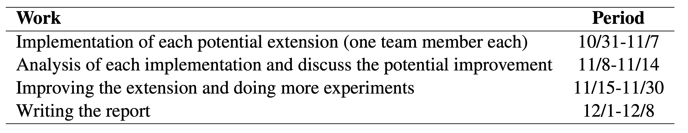

# Binder-TableQA

This repo contains the code and data for the re-implementation of Binder (Binding Language Models in Symbolic Languages) Algorithm focusing on generating SQL commands to answer tableQA problems ([paper](https://arxiv.org/abs/2210.02875) appeared in ICLR 2023)

## Training-based & Training-free Method Overview


## Dataset
We utilize the WikiTableQuestions dataset from [the breadth of the knowledge source and the depth of logical compositionally](Pasupat et al., 2021) for question-answering tasks. The WikiTableQuestions is created on HTML tables as follows. Tables were randomly selected from Wikipedia if they had a minimum of eight rows and five columns. Two Amazon Mechanical Turk tasks are created to generate question-answer pairs. After the process, around 69% of the initial questions were kept, yielding a dataset with over 22,000 examples on more than 2,100 tables. 20% of these tables and their associated questions were set aside for test- ing and development, while the rest were used for training.

## Code - Final Project

Please see folder `final`

## Code - ReImplementation
### Setup
First, create a conda environment from the yaml file and activate it:
```bash
conda env create -f py3.7binder.yaml
conda activate binder
```

Then install the records package with version 0.5.3
```bash
pip install records==0.5.3
```

### Generate OpenAI secret key
Generate and get `API keys` from [OpenAI API](https://openai.com/api/), and save the key in the `key.txt` file in one line. Please make sure you have the rights to access the model(in the implementation of this repo, `code-davinci-002`) you need.

### Annotation Step
Uncomment the certain annotation section for WikiTQ in `annotate_run.py` and run this command in the shell:
```bash
python annotate_run.py
```

### Execution Step
Uncomment the certain execution section for WikiTQ in `execute_run.py` and run this command in the shell:
```bash
python execute_run.py
```

### Schedule



## Contributors
<a href="https://github.com/zsong96wisc"> </a>
<a href="https://github.com/hippohwj"> </a>
<a href="https://github.com/xxcisxxc"> </a>

